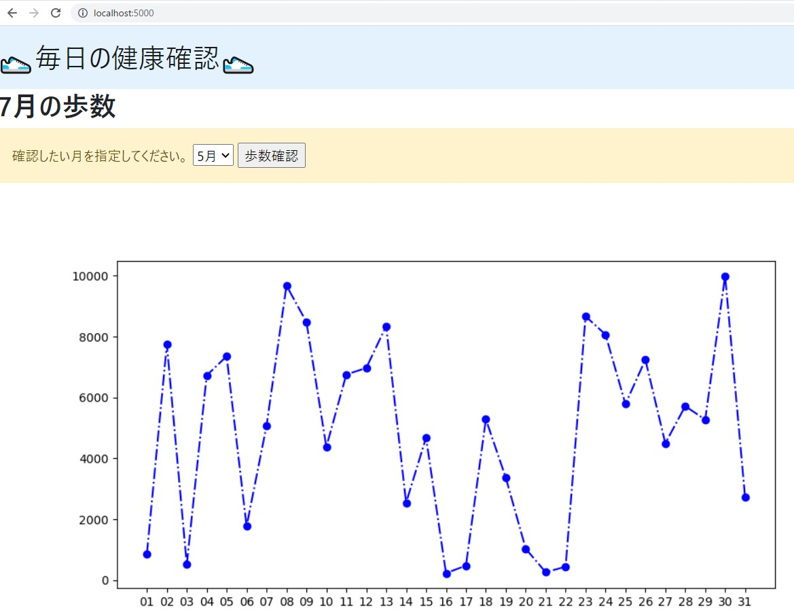

# FlaskとEmbedded Pythonで歩数データをグラフ表示してみる（Windows以外で試す方法）

Flaskで簡単にWebアプリが作成できるので、Embedded Pythonでテーブル／グローバルから月毎の歩数データを取得し、matplotlibを利用してグラフを作成し、Flask Webアプリで表示させてみました。

（このフォルダの内容はWindowsにIRISをインストールした環境でお試しいただく場合の方法です）

## 処理概要


IRISからデータを取得する処理は [table_goiris.py](./table_goiris.py)に記述し、アプリケーション処理を記述する[table_app.py](./table_app.py) から呼び出しています。

※グローバル変数からデータを取得するサンプルもご用意しています。詳しくは[末尾](#グローバル変数を利用する場合の準備)をご参照ください。


画面表示に使用しているHTMLは、[index.html](./templates/index.html) で、Flaskのrender_template()関数を利用してHTTP応答としてHTML文書を返送しています。


## 必要なモジュール

- flask
- matplotlib

## データの準備

※グローバル変数を利用したサンプルをお試しいただく場合は、[グローバル変数を利用する場合の準備](#グローバル変数を利用する場合の準備)をご参照ください。

1. IRISに接続し、[MyHealth.Step.cls](../MyHealth/Steps.cls)をUSERネームスペースにインポートします。

2. データを作成します。

    サンプルデータは、2022年5月1日～7月31日までの歩数データを作成します（ランダム生成なので実行の度に値が変わります）。

    IRISにログインUSERネームスペースで以下実行してください。

    ```
    do ##class(MyHealth.Steps).create()
    ```


以上で準備は完了です。

## アプリケーション実行

※グローバル変数を利用したサンプルをお試しいただく場合は、[アプリケーション実行-グローバル編](#アプリケーション実行-グローバル編)をご参照ください。

Embedded Pythonで利用する irisモジュールをインポートしたいので、irispythonコマンドを利用してアプリケーションを起動します。

以下の例では、/usr/irissys にIRISがインストールされている環境で試した例です。インストールディレクトリが異なる場合はディレクトリを修正して実行してください。

irispythonコマンドの後、table_app.py をフルパスで指定します。

例）
```
/usr/irissys/bin/irispython /home/isjedu/WalkSteps/Linux/table_app.py
```

[localhost:5000](http://localhost:5000) にアクセスして結果を確認して下さい（以下表示例）。




## グローバル変数を利用する場合の準備


1. IRISに接続し、[MyHealth.Step.cls](../MyHealth/Steps.cls)をUSERネームスペースにインポートします。

2. データを作成します。

    サンプルデータは、2022年5月1日～7月31日までの歩数データを作成します（ランダム生成なので実行の度に値が変わります）。

    IRISにログインし、USERネームスペースで以下実行してください。

    ```
    do ##class(MyHealth.Steps).createGlobal()
    ```

以上で準備は完了です。

## アプリケーション実行-グローバル編

Embedded Pythonで利用する irisモジュールをインポートしたいので、irispythonコマンドを利用してアプリケーションを起動します。

以下の例では、/usr/irissys にIRISがインストールされている環境で試した例です。インストールディレクトリが異なる場合はディレクトリを修正して実行してください。

irispythonコマンドの後、global_app.py をフルパスで指定します。

例）
```
/usr/irissys/bin/irispython /home/isjedu/WalkSteps/Linux/global_app.py
```

[localhost:5000](http://localhost:5000) にアクセスして結果を確認して下さい。
